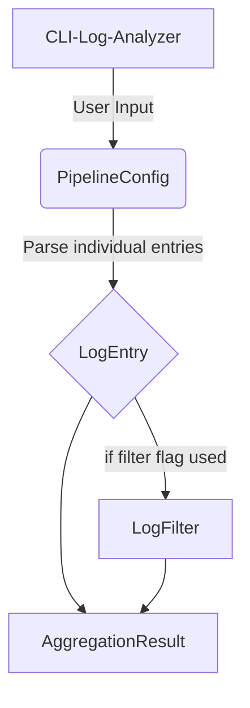

# Core Data Model

## Models

### LogEntry class
The LogEntry class will be used to create a normalized log entry regardless of how your source application is saving them. This class will take in the following parameters:
- timestamp: The string used to store the date/time of the log event. The timestamp may include a timezone in it, if it does not then we will default to UTC-0
- level: An enum used to determine the type of log we're storing (debug, info, warning, error, critical). These will be referenced from the default Pytrhon logging module
- source: Location of the log, usually a filename.
- message: The string that will display the message that was returned in the log.
- metadata: An object that stores custom data for the logger to maintain, like a correlation-id or trace-id

### LogFilter class
The LogFilter class will be used to take a custom filter and only return a list of log entries based on the existing params. For example, if you wanted to filter all of the Error logs from the multiple sources you've imported, then you could call 
```python
error_logs = LogFilter(logs=custom_log_collection, level=ERROR)
```

If you wanted to filter by a custom metadata item like trace_id you could do the following:
```python
user_logs = LogFilter(logs=custom_log_collection, metadata={trace_id: 'abc123'})
```

### AggregationResults class
The Aggregation Results class creates a summary of the logs that remained after filtering and reports back the following:
- total number of log entries
- last 5 logs
- Time of first and last log entry
- list of sources

This will be extendable as user cases are developed

### PipelineConfig
This class will be the orchestrator for the entire flow. The way this will work is:
1. A user will call the CLI tool and supply the file to parse and some flags
  1. --spacer: Boolean to see if we separate each log item via newline OR if there's a space between
  2. --file-type: String to check if this is a JSON, XML, or CLF file format to be used for parsing
  3. --filter: String formatted field=value, field to pass to our custom filter
2. The pipeline will read the file, and create a list of lines based on the spacer
3. Each line will be fed into the LogEntry class based on the filetype flag
4. Then, if the filter flag was sent it will run the logs through the LogFilter class
5. Finally, the filtered logs will be run through the AggregationResult class and the results will be printed onto the console for the user to review.

## Diagram

